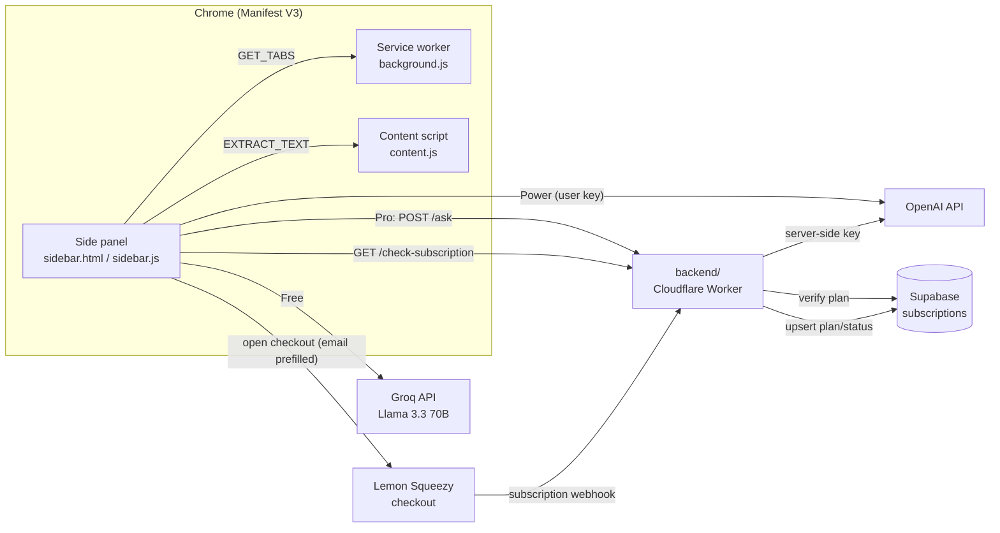

# Tabwise

**Ask one question and get an answer drawn from all your open tabs.** Tabwise is an AI research sidebar for Chrome that reads the tabs you pick, then answers, summarizes and compares across them.

[](https://chromewebstore.google.com/detail/tabwise/feclhehfbbhbhbcadpbalmmaigaaghoj)


**[Install from the Chrome Web Store](https://chromewebstore.google.com/detail/tabwise/feclhehfbbhbhbcadpbalmmaigaaghoj)**

<!-- SCREENSHOT: sidebar open next to 3 article tabs, showing an answer with sections and bullets -->
<!-- SCREENSHOT: tab selection modal + saved tab groups -->
<!-- SCREENSHOT: upgrade modal with Free / Pro / Power plans -->

---

## What it does

If you are researching with ten tabs open (product reviews, docs, papers, news), you normally read each one and piece the answer together yourself. Tabwise opens in Chrome's side panel, pulls the readable text from the tabs you choose, and sends that text with your question to an LLM. The answer comes back in the sidebar as a chat thread.

## Key features

- **Ask across tabs**: one question answered from several pages at once, formatted into sections and bullet points.
- **Compare mode** (Pro): side-by-side comparison of articles, products or sources.
- **Tab picker**: analyze all tabs automatically (up to your plan's limit) or hand-pick them.
- **Tab groups** (Pro): save named research groups and switch several on at once.
- **Conversation thread**: follow-up questions in a chat-style view.
- **Bring your own key** (Power): paste an OpenAI key for 15 tabs and no daily cap. The key is validated before it is saved.
- **Cost guards**: prompt truncation (20k chars), per-tab text caps and a `max_tokens` ceiling on every call.

| Plan  | Tabs | Daily actions | Model                         | Compare / Groups |
|-------|------|---------------|-------------------------------|------------------|
| Free  | 3    | limited       | Llama 3.3 70B via Groq        | no               |
| Pro   | 8    | 50            | GPT-4o mini via Tabwise backend | yes            |
| Power | 15   | unlimited     | GPT-4o mini with your own key | yes              |

## Architecture



- **extension/** is the Manifest V3 extension, plain JS with no build step. `sidebar.js` handles the UI, plan limits and usage counters. `utils/aiAdapter.js` sends each request to the right model.
- **backend/** is the production Cloudflare Worker. It has three routes: `/ask` (a Pro-only OpenAI proxy that checks the Supabase subscription before it spends tokens), `/check-subscription`, and `/webhook` (Lemon Squeezy events are upserted into Supabase).
- **webhook/** is an earlier standalone Lemon Squeezy webhook Worker. It verifies HMAC signatures and stores entitlements in Workers KV. It is kept for reference because the live flow now runs through `backend/`.

## Monetization and licensing flow

Tabwise is a paid product that is live on the Chrome Web Store. Its subscription loop runs end to end:

1. A free user hits a limit (tabs, daily actions or Compare), and the **upgrade modal** explains why.
2. The user enters an email, and the extension opens **Lemon Squeezy checkout** in a new tab with `checkout[email]` prefilled.
3. The extension then **polls** `/check-subscription` every 3 seconds, for up to 5 minutes.
4. When the payment clears, Lemon Squeezy calls the **webhook**, and the Worker upserts `{email, plan: PRO, status}` into **Supabase**.
5. On the next poll the extension sees `PRO/active`, unlocks the Pro limits and Compare mode, and sends requests to `/ask`. The OpenAI key stays on the server.
6. Cancellations and expirations arrive through the same webhook and downgrade the user to Free.

The Power tier skips billing: the user pays OpenAI directly with their own key, which is stored only in `chrome.storage.local`.

## Tech stack

- **Extension:** Chrome Manifest V3, Side Panel API, `chrome.scripting`, `chrome.storage`, vanilla JS (ES modules), HTML and CSS (Inter)
- **AI:** Groq (Llama 3.3 70B Versatile), OpenAI (GPT-4o mini)
- **Backend:** Cloudflare Workers (Wrangler 4)
- **Data:** Supabase (Postgres via the REST API)
- **Payments:** Lemon Squeezy subscriptions and webhooks
- **Legacy webhook:** Cloudflare Workers KV, Web Crypto HMAC-SHA256

## Privacy

Tab content is sent to an AI provider only when you ask a question. Usage counters, tab groups, your email and any API key are stored locally in the browser. Tabwise does not sell or share personal data.
Full policy: **[Tabwise Privacy Policy](https://zxvozayy.github.io/tabwise-legal/privacy-policy.html)** (a copy is in [`docs/privacy-policy.html`](docs/privacy-policy.html)).

## Local development

### Extension
1. Open `extension/utils/aiAdapter.js` and replace `YOUR_GROQ_API_KEY` with your own [Groq key](https://console.groq.com/keys). Do not commit it.
2. Go to `chrome://extensions`, turn on **Developer mode**, click **Load unpacked** and select `extension/`.
3. Click the toolbar icon to open the side panel.
4. To use your own backend, point `LEMON_SQUEEZY.apiEndpoint` in `sidebar/sidebar.js` and the `/ask` URL in `utils/aiAdapter.js` at your Worker, and `checkoutUrl` at your Lemon Squeezy product.

### Backend (Cloudflare Worker)
```bash
cd backend
npm install
cp .dev.vars.example .dev.vars        # SUPABASE_SERVICE_KEY, OPENAI_API_KEY
# set SUPABASE_URL in wrangler.jsonc
npm run dev
# production secrets:
npx wrangler secret put SUPABASE_SERVICE_KEY
npx wrangler secret put OPENAI_API_KEY
npm run deploy
```
Create the table with [`docs/supabase-schema.sql`](docs/supabase-schema.sql). Then, in Lemon Squeezy, point a webhook for the `subscription_*` events at `https://<your-worker>/webhook`.

### Legacy webhook (optional)
```bash
cd webhook
npm install
npx wrangler kv:namespace create USERS   # put the id in wrangler.toml
npx wrangler secret put WEBHOOK_SECRET
npm run deploy
```

## Project structure

```
tabwise/
├── extension/            Chrome MV3 extension (store build 1.0.0)
│   ├── manifest.json
│   ├── background.js     service worker: tab listing
│   ├── content.js        page text extraction
│   ├── sidebar/          side panel UI, plans, checkout, chat
│   ├── utils/            aiAdapter (model routing), textCleaner, creditManager
│   └── icons/
├── backend/              Cloudflare Worker: /ask, /check-subscription, /webhook
├── webhook/              earlier KV-based Lemon Squeezy webhook Worker
├── docs/                 privacy policy, Supabase schema
└── LICENSE
```

## Author

**Hasan Özay Yılmaz** ([@zxvozayy](https://github.com/zxvozayy)) · zxvozay@gmail.com

## License

Copyright (c) 2026 Hasan Özay Yılmaz. All rights reserved. The source is available for review only. See [LICENSE](LICENSE).
