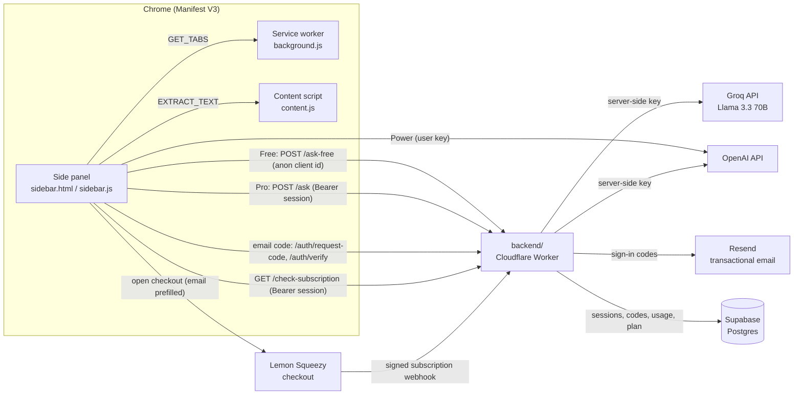

# Tabwise

**Ask one question and get an answer drawn from all your open tabs.** Tabwise is an AI research sidebar for Chrome that reads the tabs you pick, then answers, summarizes and compares across them.

[](https://chromewebstore.google.com/detail/tabwise/feclhehfbbhbhbcadpbalmmaigaaghoj)


**[Install from the Chrome Web Store](https://chromewebstore.google.com/detail/tabwise/feclhehfbbhbhbcadpbalmmaigaaghoj)**

<!-- SCREENSHOT: sidebar open next to 3 article tabs, showing an answer with sections and bullets -->
<!-- SCREENSHOT: tab selection modal + saved tab groups -->
<!-- SCREENSHOT: upgrade modal with the email sign-in code step -->

---

## What it does

If you are researching with ten tabs open (product reviews, docs, papers, news), you normally read each one and piece the answer together yourself. Tabwise opens in Chrome's side panel, pulls the readable text from the tabs you choose, and sends that text with your question to an LLM. The answer comes back in the sidebar as a chat thread.

## Key features

- **Ask across tabs**: one question answered from several pages at once, formatted into sections and bullet points.
- **Compare mode** (Pro): side-by-side comparison of articles, products or sources.
- **Tab picker**: analyze all tabs automatically (up to your plan's limit) or hand-pick them.
- **Tab groups** (Pro): save named research groups and switch several on at once.
- **Conversation thread**: follow-up questions in a chat-style view.
- **Bring your own key** (Power): paste an OpenAI key for 15 tabs and no daily cap. The key is validated before it is saved and never leaves the browser.
- **Cost guards**: prompt truncation (20k chars), per-tab text caps and a `max_tokens` ceiling on every call, plus server-side daily limits per plan.

| Plan  | Tabs | Daily actions | Model                           | Compare / Groups |
|-------|------|----------------|----------------------------------|-------------------|
| Free  | 3    | 10             | Llama 3.3 70B via Groq (backend) | no                |
| Pro   | 8    | 50             | GPT-4o mini via Tabwise backend  | yes               |
| Power | 15   | unlimited      | GPT-4o mini with your own key    | yes               |

## Architecture



- **extension/** is the Manifest V3 extension, plain JS with no build step. `sidebar.js` handles the UI and the sign-in flow. `utils/aiAdapter.js` routes every request to the backend — no AI provider key ever ships inside the extension.
- **backend/** is the production Cloudflare Worker. Routes: `/ask` (Pro, session-authenticated), `/ask-free` (Free tier, rate-limited per install and per IP), `/auth/request-code` + `/auth/verify` (email sign-in), `/check-subscription`, `/webhook` (signature-verified Lemon Squeezy events).
- **webhook/** is an earlier standalone Lemon Squeezy webhook Worker, kept for reference; the live flow now runs through `backend/`.

## Identity and security model

Earlier builds trusted whatever email the client sent. The current backend proves it instead:

- **Email sign-in**: the extension asks for an email, the Worker mails a 6-digit code (via Resend), and the extension exchanges the correct code for an opaque session token. Only the SHA-256 hash of codes and tokens is stored — never the raw values.
- **No client-supplied identity on paid routes**: `/ask` and `/check-subscription` require `Authorization: Bearer <session token>` and read the email from the session, not from the request body.
- **Signed webhook**: `/webhook` verifies the Lemon Squeezy `X-Signature` HMAC before writing anything, so only Lemon Squeezy can grant or revoke a subscription.
- **Free tier moved server-side**: `/ask-free` calls Groq with a backend-held key and enforces the daily cap itself (per anonymous install id, and per IP as a backstop), instead of trusting a client-side counter.
- **No provider keys in the extension**: Groq and OpenAI keys live only as Worker secrets.

See [`backend/migrations/001_secure_auth_and_usage.sql`](backend/migrations/001_secure_auth_and_usage.sql) for the schema (`subscriptions`, `login_codes`, `sessions`, `usage_counters`, all RLS-enabled with a service-role-only RPC for atomic usage increments) and [`backend/test/security.test.mjs`](backend/test/security.test.mjs) for the behavior under test — unsigned webhooks, session-less requests, wrong codes, and per-install/per-IP rate limits.

## Monetization flow

Tabwise is a paid product that is live on the Chrome Web Store. Its subscription loop runs end to end:

1. A free user hits a limit (tabs, daily actions or Compare), and the **upgrade modal** explains why.
2. The user enters an email and receives a **6-digit sign-in code**; entering it exchanges for a session token.
3. Already-Pro users unlock instantly; everyone else is sent to **Lemon Squeezy checkout** with the email prefilled, and the extension **polls** `/check-subscription` every 3 seconds for up to 5 minutes.
4. When payment clears, Lemon Squeezy calls the **signed webhook**, and the Worker upserts `{email, plan, status}` into **Supabase**.
5. On the next poll the extension sees `PRO`, unlocks the Pro limits and Compare mode, and sends requests to `/ask` using its session token.
6. Cancellations stay entitled until the paid period ends (`ends_at`), then downgrade to Free on the same webhook path.

The Power tier skips billing entirely: the user pays OpenAI directly with their own key, stored only in `chrome.storage.local`.

## Tech stack

- **Extension:** Chrome Manifest V3, Side Panel API, `chrome.scripting`, `chrome.storage`, vanilla JS (ES modules), HTML and CSS (Inter)
- **AI:** Groq (Llama 3.3 70B Versatile), OpenAI (GPT-4o mini)
- **Backend:** Cloudflare Workers (Wrangler 4), Web Crypto (HMAC-SHA256, SHA-256)
- **Data:** Supabase (Postgres via the REST API, RLS, an `increment_usage` RPC)
- **Email:** Resend (sign-in codes)
- **Payments:** Lemon Squeezy subscriptions and signed webhooks
- **Legacy webhook:** Cloudflare Workers KV, Web Crypto HMAC-SHA256

## Privacy

Tab content is sent to an AI provider only when you ask a question. Usage counters, tab groups, your email and any API key are stored locally in the browser; the backend stores only a session token hash, not the token itself. Tabwise does not sell or share personal data.
Full policy: **[Tabwise Privacy Policy](https://zxvozayy.github.io/tabwise-legal/privacy-policy.html)** (a copy is in [`docs/privacy-policy.html`](docs/privacy-policy.html)).

## Local development

### Extension
1. Go to `chrome://extensions`, turn on **Developer mode**, click **Load unpacked** and select `extension/`.
2. Click the toolbar icon to open the side panel.
3. To use your own backend, point `LEMON_SQUEEZY.apiEndpoint` and `BACKEND_URL` (in `utils/aiAdapter.js`) at your Worker, and `checkoutUrl` at your Lemon Squeezy product.

### Backend (Cloudflare Worker)
```bash
cd backend
npm install
cp .dev.vars.example .dev.vars   # SUPABASE_SERVICE_KEY, OPENAI_API_KEY, GROQ_API_KEY,
                                  # LEMONSQUEEZY_WEBHOOK_SECRET, RESEND_API_KEY
# set SUPABASE_URL and EMAIL_FROM in wrangler.jsonc
npm test                         # node --test test/*.test.mjs
npm run dev

# production secrets:
npx wrangler secret put SUPABASE_SERVICE_KEY
npx wrangler secret put OPENAI_API_KEY
npx wrangler secret put GROQ_API_KEY
npx wrangler secret put LEMONSQUEEZY_WEBHOOK_SECRET
npx wrangler secret put RESEND_API_KEY
npm run deploy
```
Apply [`migrations/001_secure_auth_and_usage.sql`](backend/migrations/001_secure_auth_and_usage.sql) in the Supabase SQL editor first. In Lemon Squeezy, point a webhook for the `subscription_*` events at `https://<your-worker>/webhook` and copy its signing secret into `LEMONSQUEEZY_WEBHOOK_SECRET`. In Resend, verify a sending domain and set `EMAIL_FROM` to an address on it.

### Legacy webhook (optional)
```bash
cd webhook
npm install
npx wrangler kv:namespace create USERS   # put the id in wrangler.toml
npx wrangler secret put WEBHOOK_SECRET
npm run deploy
```

## Project structure

```
tabwise/
├── extension/                Chrome MV3 extension
│   ├── manifest.json
│   ├── background.js         service worker: tab listing
│   ├── content.js            page text extraction
│   ├── sidebar/               side panel UI, sign-in, checkout, chat
│   ├── utils/                 aiAdapter (backend routing), textCleaner, creditManager
│   └── icons/
├── backend/                   Cloudflare Worker
│   ├── src/index.js           /ask, /ask-free, /auth/*, /check-subscription, /webhook
│   ├── migrations/            Supabase schema (subscriptions, sessions, login_codes, usage)
│   └── test/                  node --test security/behavior tests
├── webhook/                    earlier KV-based Lemon Squeezy webhook Worker
├── docs/                       privacy policy
└── LICENSE
```

## Author

**Hasan Özay Yılmaz** ([@zxvozayy](https://github.com/zxvozayy)) · zxvozay@gmail.com

## License

Copyright (c) 2026 Hasan Özay Yılmaz. All rights reserved. The source is available for review only. See [LICENSE](LICENSE).
